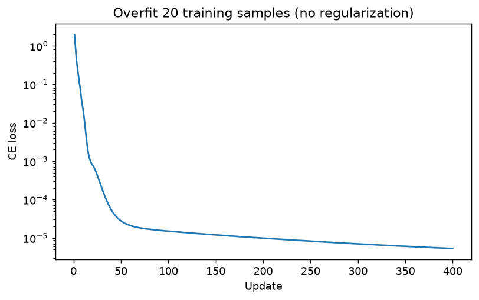
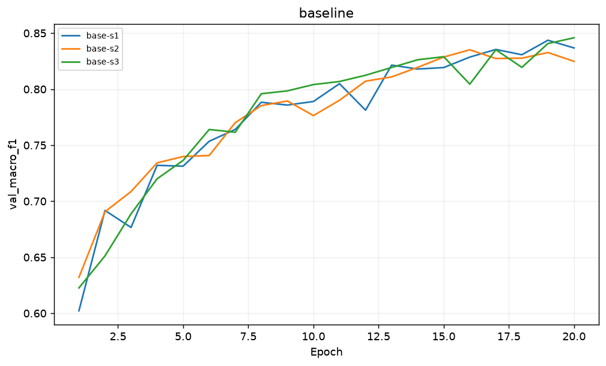
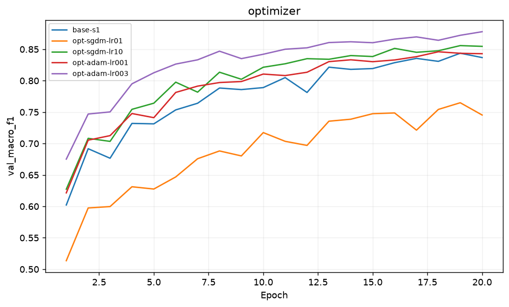
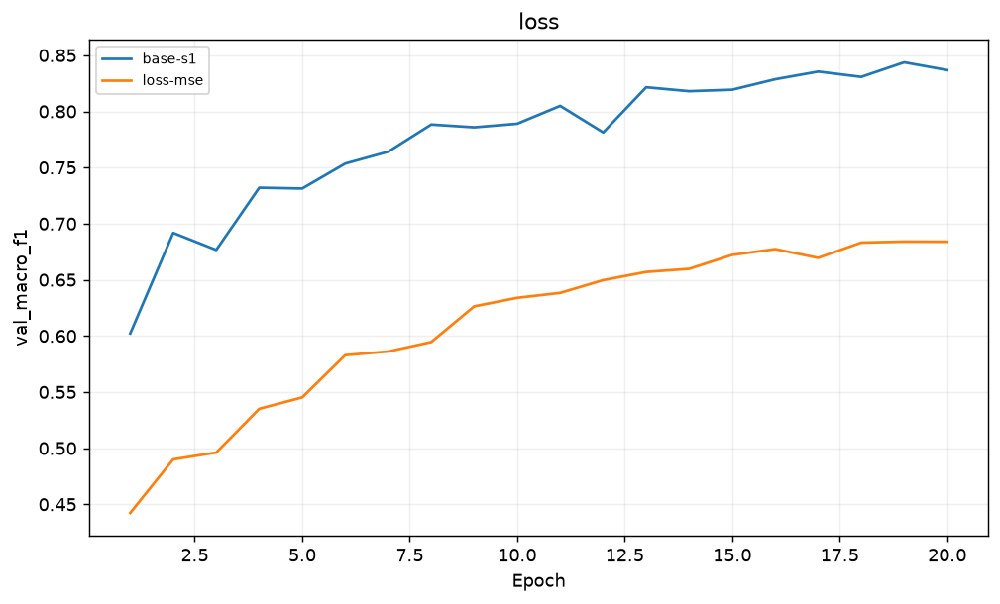
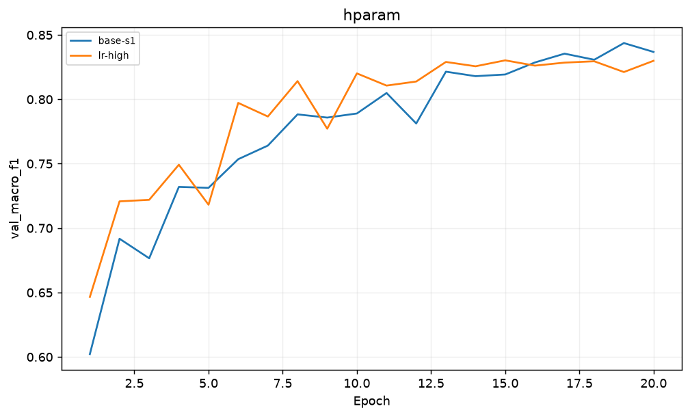
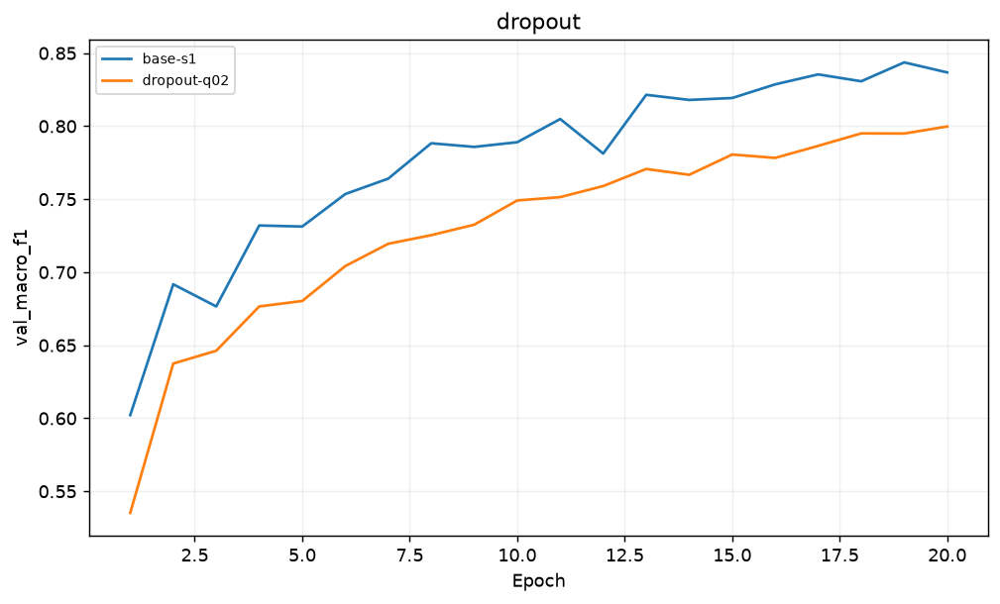
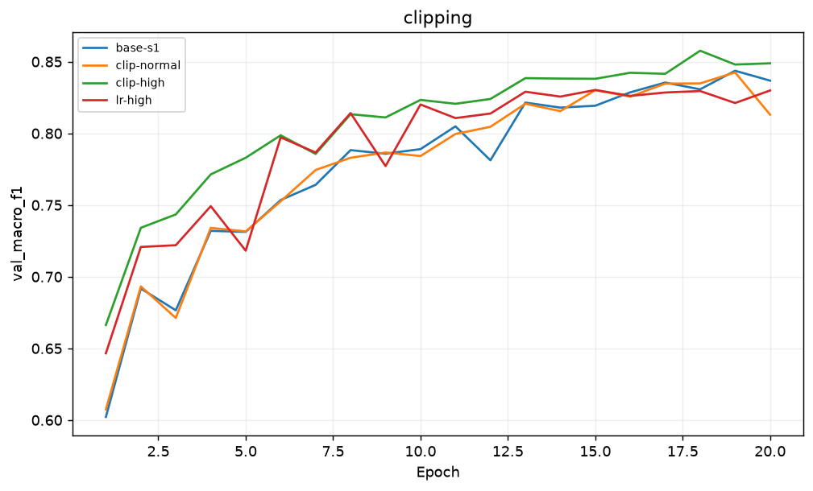
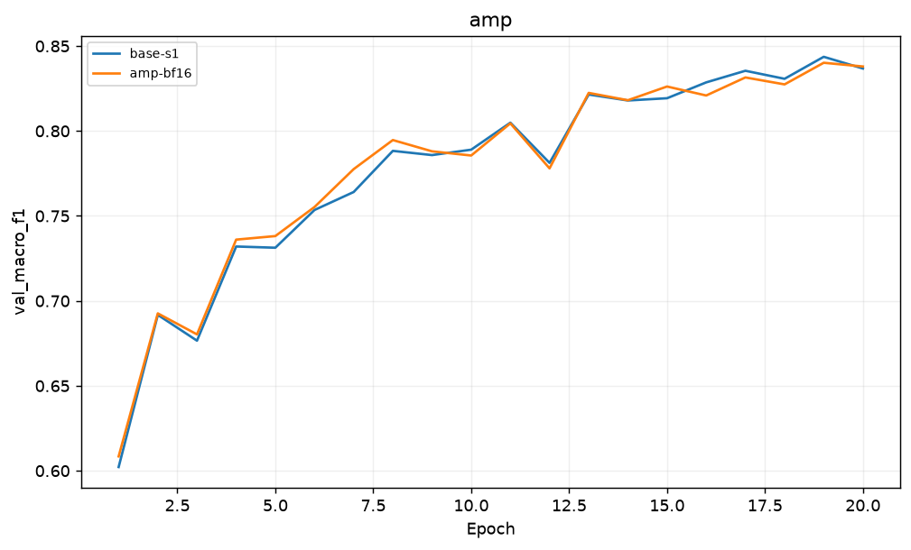
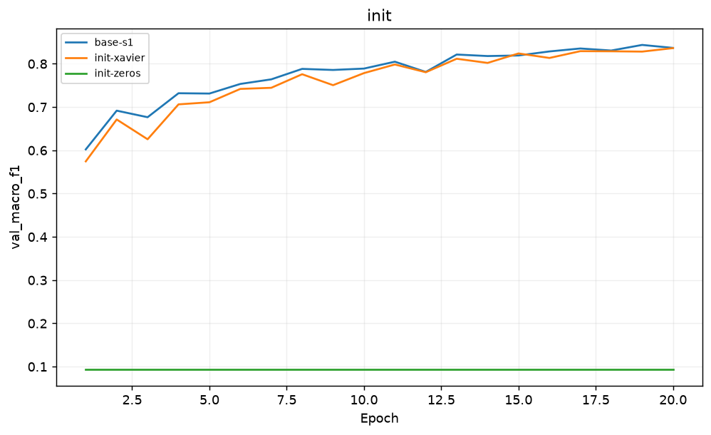
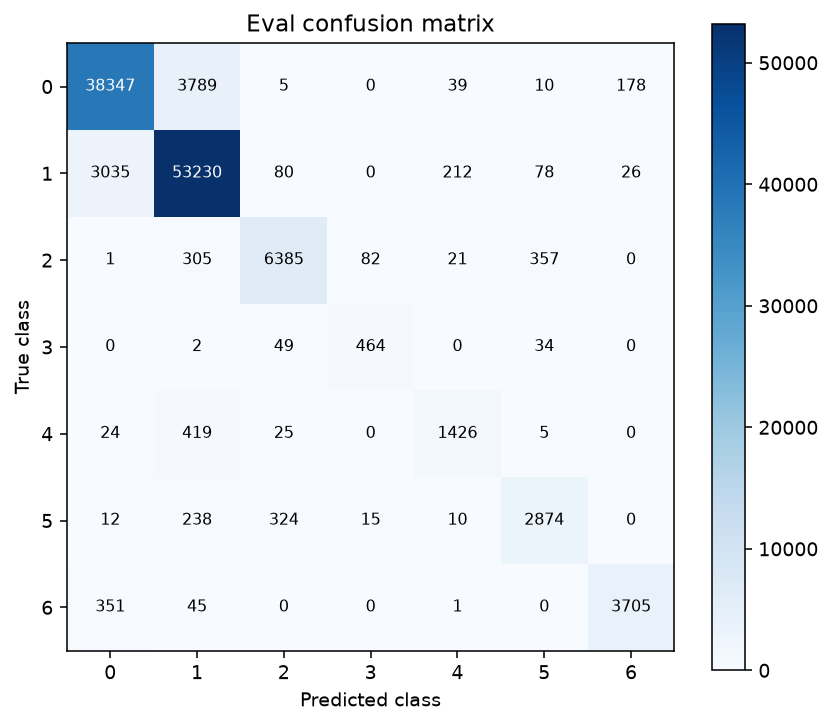

# Báo cáo Lab Day 1 — Nguyễn Văn Giáp — 2A202602903

## 1. Thiết lập

Python 3.12.14, PyTorch 2.14.1+cpu, CPU (2 threads). Forest CoverType: 464 809 train / 116 203 eval theo metadata cố định; validation phân tầng 20%, seed 42: 371 847 train / 92 962 val. Chỉ fit mean/std 10 cột số trên train; 44 cột one-hot giữ nguyên.

MLP tự định nghĩa 54→256→128→7, ReLU, bias, 47 879 tham số. Baseline CE, SGD+momentum 0.9, lr=.05, batch=512, 20 epoch, He ở mọi Linear, bias=0. Mọi thí nghiệm cùng split, 20 epoch; batch cuối vẫn dùng. Adam đổi optimizer và lr để quét lr riêng; so optimizer ở lr tốt nhất đã thử. clip-high đổi lr + clipping so baseline, nhưng chỉ đổi clipping khi so với lr-high. Các biến thể khác đổi một yếu tố. Train loss đo eval mode trên 50 000 mẫu đầu cố định. Checkpoint chọn theo val loss thấp nhất; cấu hình cuối chọn val macro-F1 của checkpoint, chỉ xét seed 1 để không chọn seed may mắn. Chạy đủ 7 chủ đề, mixed precision dùng BF16 CPU.

## 2. Kiểm tra ban đầu và độ nhiễu

| Kiểm tra | Kết quả |
|---|---|
| Số tham số / logits | 47879 / (8, 7) |
| Loss bước 0 (`base-s1`) / ln 7 | 2.269062 / 1.945910 |
| Quá khớp 20 mẫu, loss cuối sau 400 bước | 0.00000532 |
| Gradient tới mọi tham số | Có, tất cả norm > 0 ở He |
| Baseline 3 seed, val acc TB ± σ | 0.898442 ± 0.001697 |
| Baseline 3 seed, val macro-F1 TB ± σ | 0.834957 ± 0.006882 |
| Ngưỡng 2σ | 0.013764 |

Loss đầu khác ln 7 vì He ở lớp ra tạo logit không đồng đều (không buộc logit=0). Đây không tự động là lỗi: gradient có mặt và kiểm tra 20 mẫu hội tụ. Accuracy đa số trên val là 0.487597; baseline vượt mốc này. Health checks nằm ở `results/health_checks.json`; seed và cấu hình nằm trong bảng.

## 3. Kết quả theo chủ đề

Các điểm dưới đây là val tại epoch có val loss thấp nhất. Chênh lệch dùng so với `base-s1`; |Δ| > 0.013764 chỉ là vượt ngưỡng nhiễu thực nghiệm, không phải kiểm định thống kê. Ba seed chỉ đo nhiễu baseline, mỗi biến thể mới có một seed.

### baseline

**Dự đoán trước:** SGD+momentum .05 phải vượt mốc đa số; seed thay đổi thứ tự lô nên điểm có nhiễu.

| exp_id | lr | best epoch | val macro-F1 | Δ vs base-s1 | >2σ? | gap loss cuối | s/epoch |
|---|---:|---:|---:|---:|---|---:|---:|
| base-s1 | 0.05 | 20 | 0.836781 | +0.000000 | Chưa | 0.023776 | 1.439 |
| base-s2 | 0.05 | 17 | 0.827346 | -0.009435 | Chưa | 0.021559 | 1.336 |
| base-s3 | 0.05 | 19 | 0.840743 | +0.003962 | Chưa | 0.018080 | 1.401 |

**Đối chiếu:** `base-s1` bằng baseline 0.000000; `base-s2` thấp hơn baseline 0.009435; `base-s3` cao hơn baseline 0.003962. Nếu chênh lệch không vượt 2σ, chưa kết luận khác biệt ổn định. **Cơ chế:** Seed tác động khởi tạo và thứ tự lô. σ từ ba lần chỉ là ước lượng thô.

Baseline train loss 0.494416 → 0.227738; val loss 0.495571 → 0.251514. Gap cuối 0.023776; cả hai loss giảm nhưng có dao động, nên 20 epoch chưa cho thấy quá khớp kéo dài.

### optimizer

**Dự đoán trước:** Adam cập nhật thích nghi có thể hội tụ nhanh hơn; mỗi optimizer cần thử nhiều lr.

| exp_id | lr | best epoch | val macro-F1 | Δ vs base-s1 | >2σ? | gap loss cuối | s/epoch |
|---|---:|---:|---:|---:|---|---:|---:|
| opt-adam-lr001 | 0.001 | 18 | 0.845985 | +0.009204 | Chưa | 0.020154 | 1.926 |
| opt-adam-lr003 | 0.003 | 20 | 0.877917 | +0.041136 | Có | 0.029183 | 1.707 |
| opt-sgdm-lr01 | 0.01 | 19 | 0.764901 | -0.071880 | Có | 0.010569 | 1.562 |
| opt-sgdm-lr10 | 0.1 | 20 | 0.854605 | +0.017824 | Có | 0.024562 | 1.560 |

**Đối chiếu:** `opt-adam-lr001` cao hơn baseline 0.009204; `opt-adam-lr003` cao hơn baseline 0.041136; `opt-sgdm-lr01` thấp hơn baseline 0.071880; `opt-sgdm-lr10` cao hơn baseline 0.017824. Nếu chênh lệch không vượt 2σ, chưa kết luận khác biệt ổn định. **Cơ chế:** Momentum tích luỹ hướng gradient; Adam chia bước theo moment bậc hai. So lr tốt nhất trong phạm vi đã thử, không khẳng định tối ưu toàn cục.

Ở lr tốt nhất đã thử: sgd_momentum `opt-sgdm-lr10` lr=0.1, F1=0.854605; adam `opt-adam-lr003` lr=0.003, F1=0.877917.

### loss

**Dự đoán trước:** MSE logit/one-hot dự kiến học chậm hơn CE vì không trực tiếp tối ưu log-likelihood.

| exp_id | lr | best epoch | val macro-F1 | Δ vs base-s1 | >2σ? | gap loss cuối | s/epoch |
|---|---:|---:|---:|---:|---|---:|---:|
| loss-mse | 0.05 | 20 | 0.683903 | -0.152878 | Có | 0.000680 | 1.452 |

**Đối chiếu:** `loss-mse` thấp hơn baseline 0.152878. Nếu chênh lệch không vượt 2σ, chưa kết luận khác biệt ổn định. **Cơ chế:** CE có gradient logit p-y. MSE ở đây dùng logit thô, mean trên 7 tọa độ: gradient 2(z-onehot)/7; không so trị số loss giữa CE và MSE.

### hparam

**Dự đoán trước:** lr cao .5 có thể làm loss/gradient dao động hơn .05; chưa chắc phân kỳ.

| exp_id | lr | best epoch | val macro-F1 | Δ vs base-s1 | >2σ? | gap loss cuối | s/epoch |
|---|---:|---:|---:|---:|---|---:|---:|
| lr-high | 0.5 | 20 | 0.829921 | -0.006861 | Chưa | 0.028826 | 1.555 |

**Đối chiếu:** `lr-high` thấp hơn baseline 0.006861. Nếu chênh lệch không vượt 2σ, chưa kết luận khác biệt ổn định. **Cơ chế:** Tăng lr làm bước cập nhật lớn hơn; cùng 20 epoch và batch 512 giữ số bước như nhau.

### dropout

**Dự đoán trước:** q=.2 có thể giảm gap train–val nhưng làm chậm học nếu baseline chưa quá khớp.

| exp_id | lr | best epoch | val macro-F1 | Δ vs base-s1 | >2σ? | gap loss cuối | s/epoch |
|---|---:|---:|---:|---:|---|---:|---:|
| dropout-q02 | 0.05 | 19 | 0.794955 | -0.041826 | Có | 0.007930 | 3.237 |

**Đối chiếu:** `dropout-q02` thấp hơn baseline 0.041826. Nếu chênh lệch không vượt 2σ, chưa kết luận khác biệt ổn định. **Cơ chế:** Dropout tăng nhiễu lúc train; cả train loss và val loss đều đo eval mode. Gap cuối dương là dấu hiệu cần xét, không đủ để kết luận mọi regularization có lợi.

Gap cuối giảm từ 0.023776 xuống 0.007930, nhưng F1 thay đổi -0.041826. Giảm gap không đồng nghĩa tăng khả năng tổng quát; thêm nhiễu có thể làm chưa khớp trong cùng ngân sách 20 epoch.

### clipping

**Dự đoán trước:** Cắt ở phân vị 90% gradient baseline; có thể giảm gai ở lr cao, không chắc tăng F1.

| exp_id | lr | best epoch | val macro-F1 | Δ vs base-s1 | >2σ? | gap loss cuối | s/epoch |
|---|---:|---:|---:|---:|---|---:|---:|
| clip-high | 0.5 | 19 | 0.848018 | +0.011236 | Chưa | 0.028025 | 1.520 |
| clip-normal | 0.05 | 19 | 0.842514 | +0.005733 | Chưa | 0.023043 | 1.474 |

**Đối chiếu:** `clip-high` cao hơn baseline 0.011236; `clip-normal` cao hơn baseline 0.005733. Nếu chênh lệch không vượt 2σ, chưa kết luận khác biệt ổn định. **Cơ chế:** Global L2 clipping nhân gradient với min(1,c/||g||); giữ hướng nhưng giảm bước. Nó không sửa được nhãn sai hoặc lr quá nhỏ.

`clip-high`: c=1.047024; tỷ lệ lô bị clip trung bình 0.0007; norm lớn nhất trước clip 3.1366.

`clip-normal`: c=1.047024; tỷ lệ lô bị clip trung bình 0.1007; norm lớn nhất trước clip 2.8711.

So cặp lr cao: clip-high F1=0.848018 vs lr-high 0.829921, Δ=+0.018097; vượt 2σ. Lr-high không phân kỳ; không gọi clipping là cứu phân kỳ trong lần chạy này.

### amp

**Dự đoán trước:** BF16 CPU có thể nhanh hơn nếu CPU hỗ trợ; F1 có thể lệch do làm tròn.

| exp_id | lr | best epoch | val macro-F1 | Δ vs base-s1 | >2σ? | gap loss cuối | s/epoch |
|---|---:|---:|---:|---:|---|---:|---:|
| amp-bf16 | 0.05 | 19 | 0.840162 | +0.003381 | Chưa | 0.021875 | 3.309 |

**Đối chiếu:** `amp-bf16` cao hơn baseline 0.003381. Nếu chênh lệch không vượt 2σ, chưa kết luận khác biệt ổn định. **Cơ chế:** Autocast BF16 chỉ bọc forward/loss, tham số và optimizer vẫn FP32. CPU không có CUDA nên không đo FP16 hay CUDA peak memory; thời gian phụ thuộc phần cứng.

BF16/FP32 time ratio = 2.299; BF16 chậm hơn trên CPU đã đo. Các thời gian ghi ở cột time_per_epoch_s; không có phép đo bộ nhớ CUDA.

### init

**Dự đoán trước:** Xavier có phương sai nhỏ hơn He; zeros giữ đối xứng và chỉ học bias đầu ra.

| exp_id | lr | best epoch | val macro-F1 | Δ vs base-s1 | >2σ? | gap loss cuối | s/epoch |
|---|---:|---:|---:|---:|---|---:|---:|
| init-xavier | 0.05 | 17 | 0.829237 | -0.007544 | Chưa | 0.021151 | 1.435 |
| init-zeros | 0.05 | 16 | 0.093650 | -0.743131 | Có | 0.003385 | 1.428 |

**Đối chiếu:** `init-xavier` thấp hơn baseline 0.007544; `init-zeros` thấp hơn baseline 0.743131. Nếu chênh lệch không vượt 2σ, chưa kết luận khác biệt ổn định. **Cơ chế:** ReLU cần phá đối xứng: zeros làm gradient các lớp ẩn bằng 0. He dùng Var=2/fan_in; Xavier dùng 2/(fan_in+fan_out). Stats đo sau từng Linear.

Activation std sau từng Linear / loss bước 0: `base-s1` [0.670908, 0.649183, 0.588476] / 2.269062; `init-xavier` [0.280013, 0.221227, 0.195271] / 2.022176; `init-zeros` [0.0, 0.0, 0.0] / 1.945910.

## 4. Đánh giá cuối trên eval

Chọn `opt-adam-lr003` bằng val trước khi gọi script chấm; lưu quyết định trong `results/selection.json`. Không điều chỉnh cấu hình sau khi xem eval.

| Cấu hình | seed | val macro-F1 | eval macro-F1 | eval accuracy |
|---|---:|---:|---:|---:|
| base-s1 | 1 | 0.836781 | 0.839858 | 0.897369 |
| opt-adam-lr003 | 1 | 0.877917 | 0.877660 | 0.915906 |

Cải thiện eval = +0.037802; độ lệch eval–val của cấu hình cuối = -0.000257. Vượt ngưỡng 2σ val. Không đo σ eval vì chỉ chấm baseline seed 1 và cấu hình cuối; không coi σ val là ước lượng σ eval.

### Phân tích lỗi theo lớp

| Lớp | support | precision | recall | F1 |
|---|---:|---:|---:|---:|
| 0 | 42368 | 0.918051 | 0.905093 | 0.911526 |
| 1 | 56661 | 0.917316 | 0.939447 | 0.928249 |
| 2 | 7151 | 0.929674 | 0.892882 | 0.910907 |
| 3 | 549 | 0.827094 | 0.845173 | 0.836036 |
| 4 | 1899 | 0.834406 | 0.750922 | 0.790466 |
| 5 | 3473 | 0.855867 | 0.827527 | 0.841458 |
| 6 | 4102 | 0.947813 | 0.903218 | 0.924978 |

Lớp khó nhất 4: F1=0.790466, support=1899; nhầm nhiều nhất sang lớp 1 (419 mẫu). Mất cân bằng có thể giảm số bước học cho lớp hiếm; đặc trưng địa hình giữa lớp có thể chồng lấn, nhưng đây là giả thuyết chưa kiểm tra trực tiếp. Lần tiếp theo thử weighted CE và xem recall lớp này trên val.

## 5. Trả lời câu hỏi dẫn dắt

1. SGD+momentum tốt nhất đã thử: `opt-sgdm-lr10` lr=0.1, val F1=0.854605; Adam: `opt-adam-lr003` lr=0.003, F1=0.877917. Khi không chỉnh lr có thể đảo thứ hạng; không suy rộng từ cùng một lr cho mọi optimizer.

2. Dropout chỉ có lợi khi giảm overfit đủ bù việc giảm năng lực học; xem gap cuối và F1 ở mục dropout, không mặc định q càng cao càng tốt.

3. Clipping hạn chế độ lớn bước khi gradient lớn; tỷ lệ clip và max norm ở mục clipping cho biết nó thực sự kích hoạt. Có thể giảm gai mà vẫn không tăng F1.

4. BF16 được đo trực tiếp với FP32 ở mục amp. Tốc độ phụ thuộc kernel CPU và overhead autocast của MLP nhỏ; kết quả này không trả lời được tốc độ trên GPU FP16.

5. Zeros khiến lớp ẩn ReLU bằng 0, gradient trọng số bằng 0; bias lớp cuối học phân bố nhãn. He bù việc ReLU làm mất một phần phương sai; Xavier cân đối fan-in/fan-out.

6. Nếu loss không giảm sau 2 000 bước: (a) kiểm tra shape, dtype, nhãn 0..6, chuẩn hoá chỉ từ train và loss bước 0 để phát hiện dữ liệu/logit bất thường; (b) quá khớp 20 mẫu không regularization để kiểm tra pipeline update; (c) xem gradient từng lớp và norm trước clip, lr, zero_grad/backward/step để phát hiện gradient chết, bước quá nhỏ hoặc nổ gradient.

## 6. Hạn chế và điều bất ngờ

Chỉ ba seed baseline, một seed mỗi biến thể; so sánh vượt 2σ chưa phải bằng chứng thống kê đầy đủ. Lr được quét trong phạm vi nhỏ (SGD+momentum .01/.05/.1, Adam .001/.003), không tìm tối ưu toàn cục. MSE dùng lr baseline nên kết luận về loss phụ thuộc lr. BF16 CPU không thay cho thí nghiệm FP16 GPU; không có số đo CUDA memory. Health loss đầu cao hơn ln 7 là do logit khởi tạo, không ép kết quả về mốc lý thuyết. Chỉ chạy 20 epoch nên mô hình có thể còn chưa khớp; quan sát F1/loss theo epoch để đánh giá. σ từ checkpoint chọn trên val có thể lạc quan. Train loss dùng tập con cố định, không toàn bộ train.

## 7. Phụ lục

Bài nộp: REPORT.md, experiments.xlsx (Legend/Experiments/Seeds/Summary), predictions_eval.csv, eval_result.json, eval_baseline.json, predictions_baseline.csv, figures/, results/, code/ gồm notebook và tất cả module. Template bảng đi kèm trong code/ để chạy lại khi chỉ có bài nộp + data/ + scripts/. Không nộp data hay trọng số.

15 thí nghiệm, mỗi thí nghiệm một JSON và ảnh có đúng exp_id; tổng thời gian epoch đo được 526.8s. Chạy lại bằng notebook Restart & Run All hoặc `python code/run_lab.py` từ thư mục nộp.
